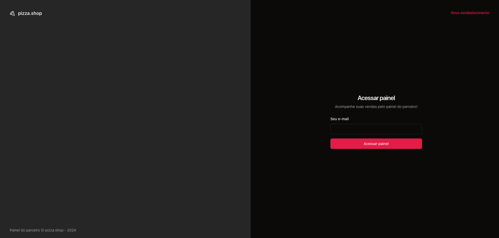
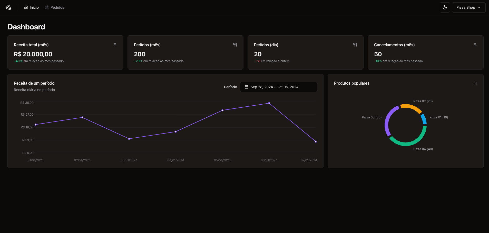
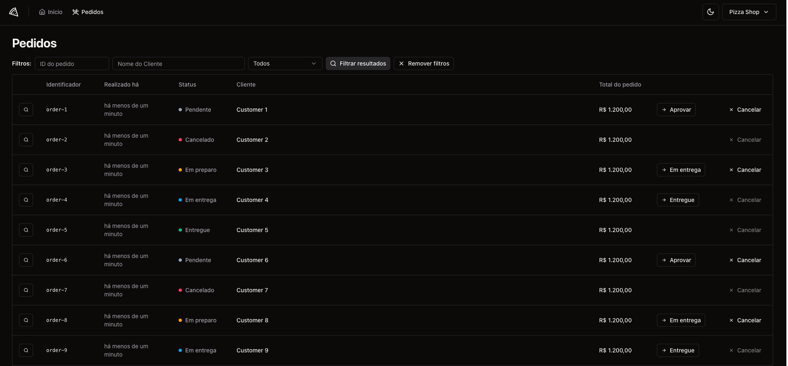

# Ignite - Delivery App 
This project is a **Delivery App**  developed using **React** , **TypeScript** , and **Vite** . It is part of the **Rocketseat Ignite course** . The objective of this project was to create a modern web application interface using the latest technologies and best practices in React development.
## Objective 

The goal of this course was to build a delivery management system with a modern user interface, focusing on performance, usability, and maintainability, using the most up-to-date tools and libraries in the React ecosystem.

## Tech Stack 
 
1. **Frontend Libraries:**  
  - React (`react`, `react-dom`)
 
  - React Router (`react-router-dom`)
 
  - React Hook Form (`react-hook-form`)

  - Recharts (for chart rendering)

  - Lucide React (icons)

  - Shadcn/UI (various components like dialog, dropdown menu, label, select, separator, skeleton)
 
2. **Backend Interaction:**  
  - Axios (`axios`) for HTTP requests
 
  - React Query (`@tanstack/react-query`) for data fetching and synchronization
 
  - Mock Service Worker (MSW) (`msw`) for API mocking during development and testing
 
3. **Form Validation:**  
  - Zod (`zod`) for schema validation
 
  - Hookform Resolvers (`@hookform/resolvers`) for integrating with Zod
 
4. **Styling:**  
  - Tailwind CSS and plugins (`tailwindcss`, `tailwindcss-animate`, `tailwind-merge`)
 
5. **Date Utilities:**  
  - Date-fns (`date-fns`) for date manipulation
 
  - React Day Picker (`react-day-picker`) for date picking functionality
 
6. **Development Tools:** 
  - Vite as the build tool
 
  - ESLint for linting (`eslint`, `@rocketseat/eslint-config`)
 
  - Prettier for code formatting (`prettier`, `prettier-plugin-tailwindcss`)

  - TypeScript for type checking
 
  - Vitest (`vitest`) and Testing Library (`@testing-library/react`, `@testing-library/jest-dom`) for testing
 
  - **Playwright**  (`@playwright/test`) for end-to-end testing and browser automation
  
## Print Screen

